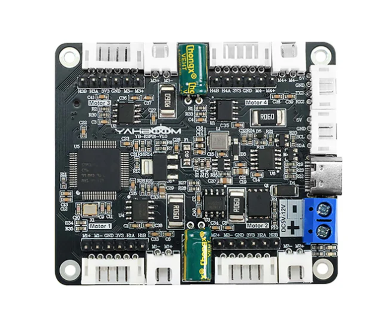
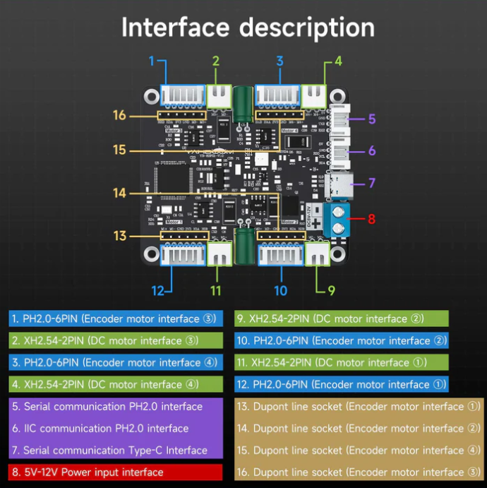
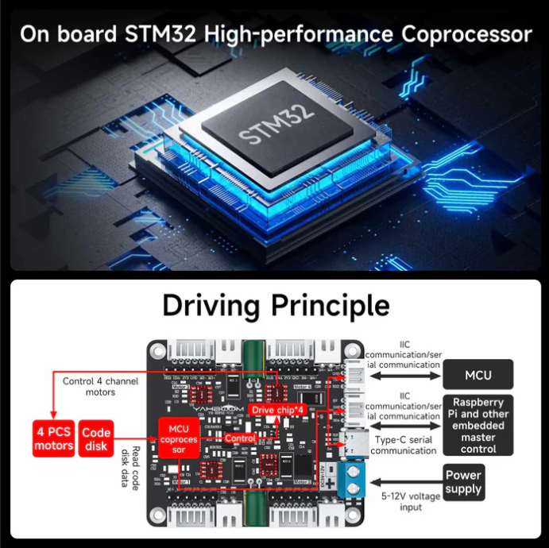
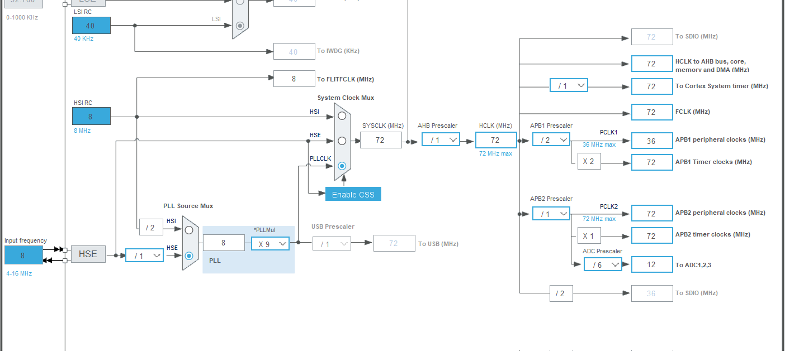
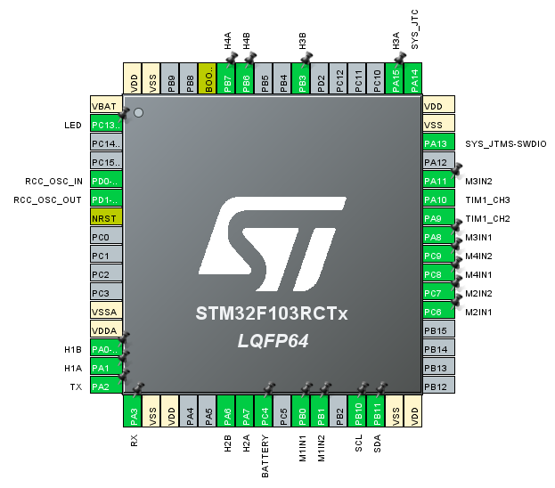

# Visao geral da placa

## Objetivo

Esta firmware controla 4 motores DC com encoder e fecha malha de velocidade em `1 kHz`. A placa recebe comandos de velocidade do robo por serial, converte para velocidades individuais das rodas e aplica PID em cada motor.

## Fotos e referencias visuais

### Placa completa

### Interface externa

### Chip de acionamento

## Fluxo de controle

1. `main()` inicializa GPIO, DMA, ADC, timers, I2C e `USART2`.
2. `AppC_Init()` cria a aplicacao C++ e inicia PWM, encoders e calibracao do ADC.
3. `TIM6` interrompe a cada `1 ms` e chama `AppC_FastTick1kHz()`.
4. No fast tick:
   - le encoder de cada roda
   - calcula RPM
   - filtra RPM com um biquad passa-baixa
   - roda 4 controladores PID
   - atualiza o PWM de cada motor
5. No loop principal:
   - processa recepcao serial por DMA circular
   - envia telemetria
   - atualiza leitura de bateria e heartbeat do LED

## MCU e perifericos

- MCU: `STM32F103RCTx`
- Encapsulamento: `LQFP64`
- Clock do sistema: `72 MHz` com cristal externo em `8 MHz` + `PLL x9`
- `TIM1` e `TIM8`: PWM dos motores
- `TIM2`, `TIM3`, `TIM4`, `TIM5`: interface encoder
- `TIM6`: base de tempo do controle em `1 kHz`
- `USART2`: comunicacao serial em `1000000 baud`
- `ADC1` canal `IN14 / PC4`: leitura da bateria
- `I2C2`: reservado em `PB10/PB11`

## Arvore de clock

Configuracao atual do CubeMX:

- `HSE = 8 MHz`
- `PLL source = HSE`
- `PLL multiplier = x9`
- `SYSCLK = 72 MHz`
- `AHB = 72 MHz`
- `APB1 = 36 MHz`
- clocks efetivos dos timers em `APB1 = 72 MHz`
- `APB2 = 72 MHz`
- clock do ADC = `12 MHz` com prescaler `/6`

Impacto direto no firmware:

- `TIM1` e `TIM8` usam clock de `72 MHz`, o que leva a PWM de `30 kHz` com `ARR = 2399`
- `TIM6` usa prescaler `71` e periodo `999`, gerando a interrupcao de `1 kHz`
- os timers de encoder tambem operam com base de `72 MHz`

## Mapeamento dos motores

Ordem eletrica usada no firmware:

- `M1`: frente-direita
- `M2`: frente-esquerda
- `M3`: traseira-direita
- `M4`: traseira-esquerda

Saidas PWM:

- `M1`: `TIM1 CH2/CH3` nos pinos `PA9` e `PA10`, com complementares `CH2N/CH3N` em `PB0` e `PB1`
- `M2`: `TIM8 CH1/CH2` nos pinos `PC6` e `PC7`
- `M3`: `TIM1 CH1/CH4` nos pinos `PA8` e `PA11`
- `M4`: `TIM8 CH3/CH4` nos pinos `PC8` e `PC9`

Entradas de encoder:

- `M1`: `TIM5` em `PA0` e `PA1`
- `M2`: `TIM3` em `PA6` e `PA7`
- `M3`: `TIM2` em `PA15` e `PB3`
- `M4`: `TIM4` em `PB6` e `PB7`

Observacao: o encoder de `M3` e invertido por software.

## Pinagem geral

Pinos usados pelo firmware:

- `PC13`: LED
- `PD0` e `PD1`: oscilador externo `HSE`
- `PA2/PA3`: `USART2 TX/RX`
- `PC4`: bateria em `ADC1_IN14`
- `PB10/PB11`: `I2C2 SCL/SDA`
- `PA13/PA14`: `SWDIO/SWCLK`

Pinos livres ou nao usados nesta firmware permanecem sem funcao aplicada no `.ioc`.

## Parametros atuais

- PWM: `30 kHz` (`ARR = 2399`)
- Amostragem de RPM: `1 ms`
- PID:
  - `Kp = 16.9`
  - `Ki = 89.3`
  - `Kd = 0.001`
- Saturacao do PID: `-2399` a `2399`
- Limite de setpoint: `+/- 530 rpm`
- Encoder:
  - `11 PPR`
  - quadratura `x4`
  - reducao `18.8:1`
  - ticks por volta da roda: `827.2`

## Bateria

- Entrada analogica: `PC4`
- Referencia ADC: `3.3 V`
- Resolucao: `12 bits`
- Divisor resistivo modelado como:
  - parte alta `10 kohm`
  - parte baixa `3.3 kohm`
- ganho aplicado no software: `(10 + 3.3) / 3.3 = 4.03`
- taxa de atualizacao: `100 ms`

## Modos de parada

Quando o comando de um motor e zero:

- `brake_mode = 0`: coast, PWM zerado nos dois lados
- `brake_mode = 1`: brake, dois lados em nivel alto

## LED

O LED em `PC13` alterna estado a cada `200 ms`, servindo como heartbeat da firmware.
